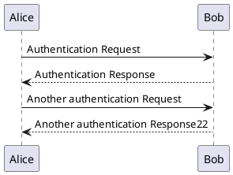

# 插件测试案例

## 1.1 图片预览测试


## 1.2 代码复制测试

```java

public class HelloWorld{
    public static void main(String[] args){
    System.out.println("Hello World !");
}
}

```

## 1.3 Markdown 测试

### 1.3.1 TODO 任务列表

```markdown
- [x] 起床
- [ ] 睡觉
```

- [x] 起床
- [ ] 睡觉

### 1.3.2 Tab 选项卡

```markdown
<!-- tabs:start -->
#### **English**
Hello!
#### **中文**
你好!
<!-- tabs:end -->
```

<!-- tabs:start -->
#### **English**
Hello!
#### **中文**
你好!
<!-- tabs:end -->

### 1.3.3 FAQ 问答

```markdown
+ 问题1? +

  答案1

+ 问题2? +

  答案2
```


+ 问题1? +

  答案1

+ 问题2? +

  答案2

### 1.3.4 Flexible-alerts

```markdown
> [!TIP]
> An alert of type 'tip' using global style 'callout'.

> [!NOTE]
> An alert of type 'note' using global style 'callout'.

> [!WARNING]
> An alert of type 'warning' using global style 'callout'.

> [!ATTENTION]
> An alert of type 'attention' using global style 'callout'.

  ```

> [!TIP]
> An alert of type 'tip' using global style 'callout'.

> [!NOTE]
> An alert of type 'note' using global style 'callout'.

> [!WARNING]
> An alert of type 'warning' using global style 'callout'.

> [!ATTENTION]
> An alert of type 'attention' using global style 'callout'.

### 1.3.5 Kroki Mermaid

```markdown
graph TD;
    A-->B;
    A-->C;
    B-->D;
    C-->D;
```


### 1.3.6 Kroki Plantuml

```markdown
@startuml
Alice -> Bob: Authentication Request
Bob --> Alice: Authentication Response

Alice -> Bob: Another authentication Request
Alice <-- Bob: Another authentication Response22
@enduml
```




### 1.3.7 iframe

```markdown
<iframe src="//player.bilibili.com/player.html?aid=298790645&bvid=BV1uF411M7Tn&cid=712764047&p=1" height = "500" scrolling="no" border="0" frameborder="no" framespacing="0" allowfullscreen="true" width="50%" height="50%"> </iframe>
```

<iframe src="//player.bilibili.com/player.html?aid=298790645&bvid=BV1uF411M7Tn&cid=712764047&p=1" height = "500" scrolling="no" border="0" frameborder="no" framespacing="0" allowfullscreen="true" width="50%" height="50%"> </iframe>

### 1.3.8 html 预览

```markdown
<div align="center">
  <a href="https://gitee.com/cola777jz/cola777jz-docsify-template">
    
  </a>
</div>
<h3 align="center">cola777jz-docsify-template</h3>

<p align="center">
  Docsify Template
  <br />
  <a href="https://gitee.com/cola777jz/cola777jz-docsify-template/tree/master/"><strong>项目文档</strong></a>
  <br />
  <br />
  <a href="https://gitee.com/cola777jz/cola777jz-docsify-template/issues">Report Bug</a>
  ·
  <a href="https://gitee.com/cola777jz/cola777jz-docsify-template/pulls">Request Feature</a>
</p>
```

<div align="center">
  <a href="https://gitee.com/cola777jz/cola777jz-docsify-template">
    
  </a>
</div>
<h3 align="center">cola777jz-docsify-template</h3>

<p align="center">
  Docsify Template
  <br />
  <a href="https://gitee.com/cola777jz/cola777jz-docsify-template/tree/master/"><strong>项目文档</strong></a>
  <br />
  <br />
  <a href="https://gitee.com/cola777jz/cola777jz-docsify-template/issues">Report Bug</a>
  ·
  <a href="https://gitee.com/cola777jz/cola777jz-docsify-template/pulls">Request Feature</a>
</p>